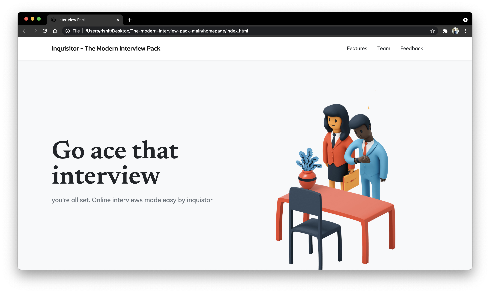
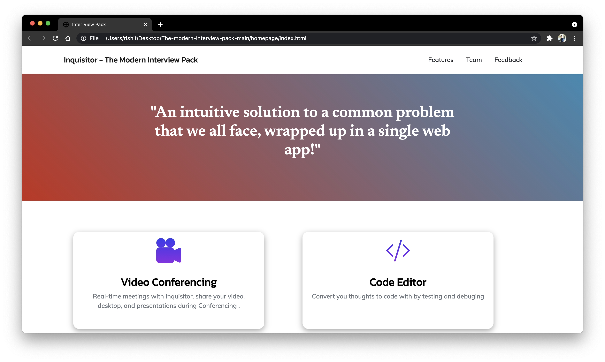
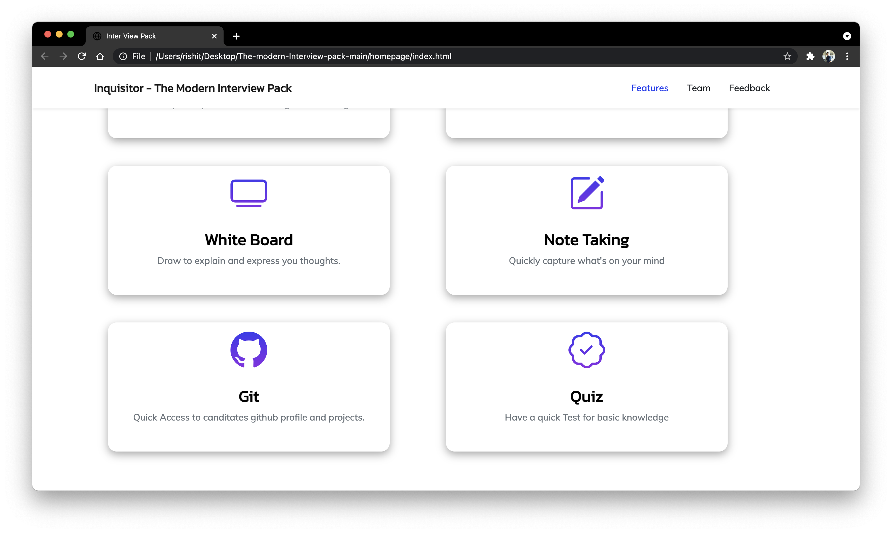
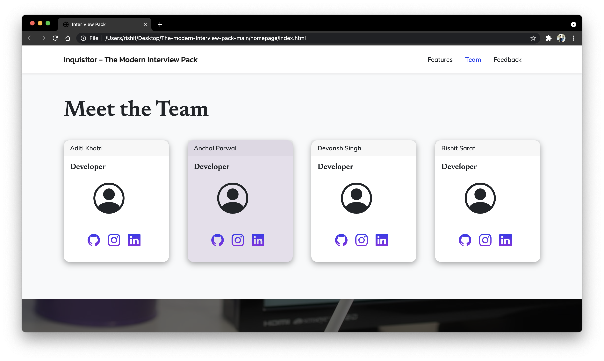
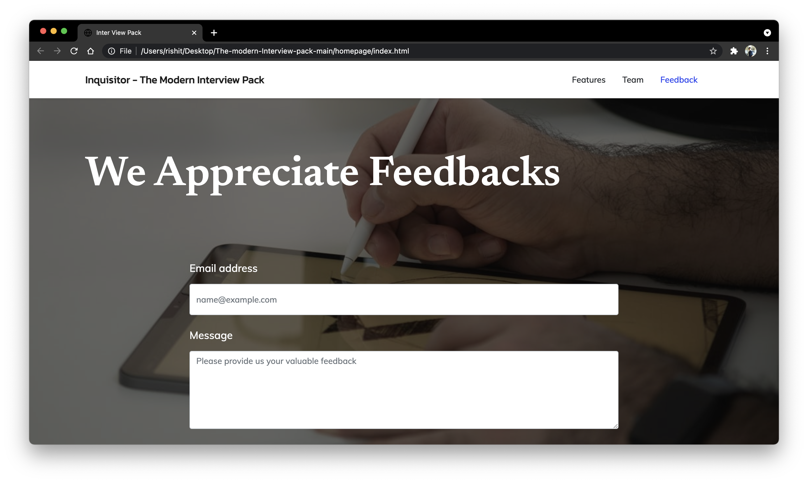

https://drive.google.com/file/d/1Azi0iXNcNeJnfC9939gOujgtStBqEQC6/view?usp=sharing
<a href="https://drive.google.com/file/d/1Azi0iXNcNeJnfC9939gOujgtStBqEQC6/view?usp=sharing"><b>Explanatory PPT</b></a>
## API Reference

#### API

```http
 https://api.github.com
```


 Used Name, description, and html_url keys from each object within the data array.

## Statement
Inquisitor is complete recruitment software made for fast tracking the work of recruiters. Inquisitor comes with various features in a single place to ease the process of recruitments. Inquisitor brings everything at recruiter's fingertips without opening multiple windows.
## Description
This is an integrated interface to facilitate remote interviews for recruiters so that the interviewees can showcase their skills more effectively.


Features offered by . . .

### A audio-video interface ###
- Implemented using webRTC
- Presently supports a peer-to-peer connection

### A real-time whiteboard ###
- Implemented using socketIO

### Access to GitHub profile ##
- Implemented using Github v3 API
- Overview of repositories 
    
### Code Editor ###
- Code editor for smooth interview testing

### Note taker ##
- Implemented using java script 
- For storing important information

### Quiz ##
-Additional feature testing basic 

 
## Demo

<a href="https://youtu.be/eE0R33IwK34">Youtube Demo link</a>

  
## Screenshots

</img><br>
</img><br>
</img><br>
</img><br>
</img><br>


  
## Deployment

To deploy this project run

```bash
  npm run deploy
```

  
  
## Usage/Examples

```javascript
import Component from 'my-project'

function App() {
  return <Component />
}
```

  
## Lessons Learned

What did you learn while building this project? What challenges did you face and how did you overcome them?

  

## Authors

- [Aditi ](https://github.com/Adi-khatri)
- [Anchal ](https://github.com/Anchal1226)
- [Devansh ](https://github.com/devanshpratapsingh)
- [Rishit ](github.com/rishitsaraf)


  
## Feedback

If you have any feedback, please reach out to us at fake@fake.com


